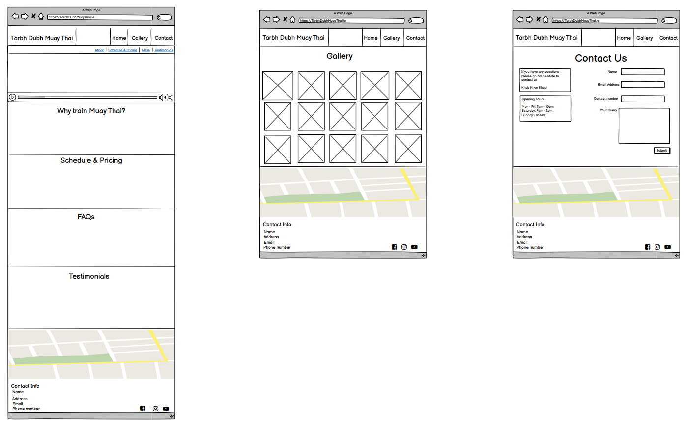
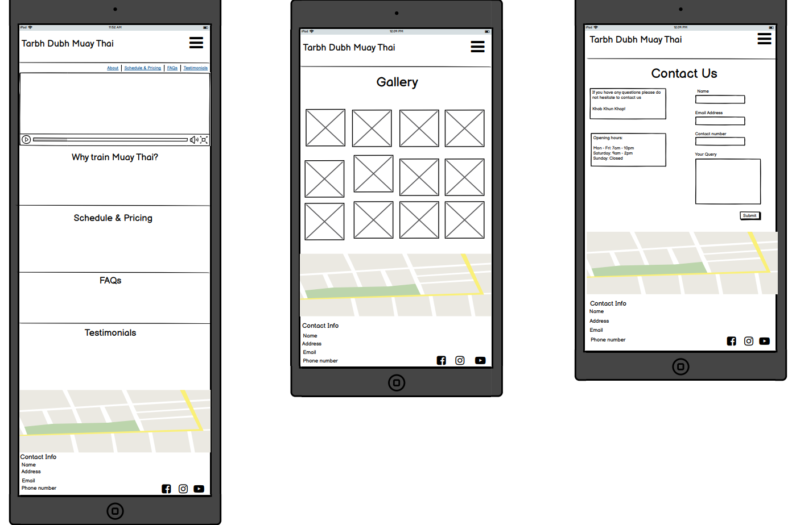
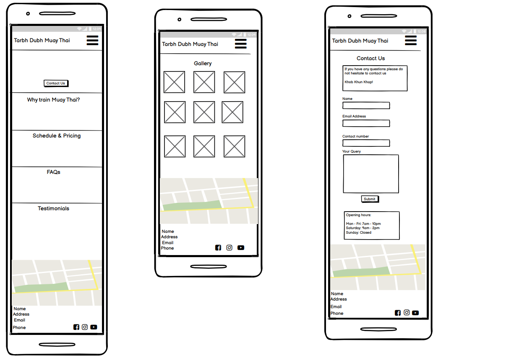
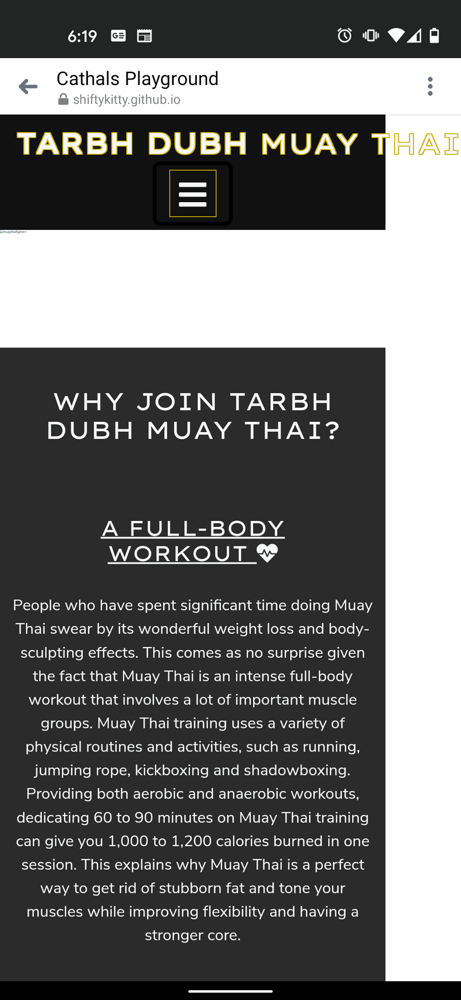
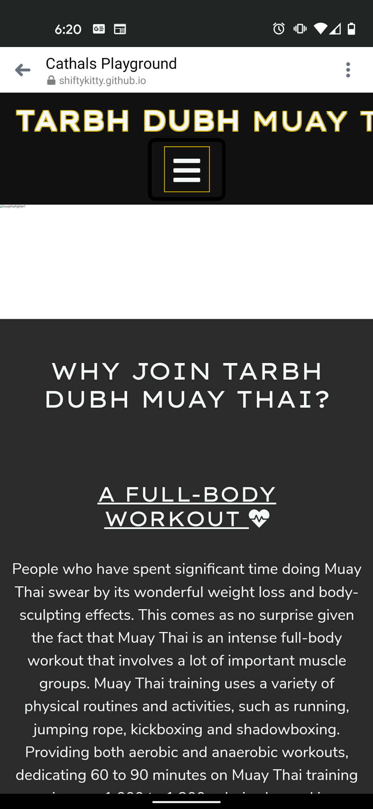
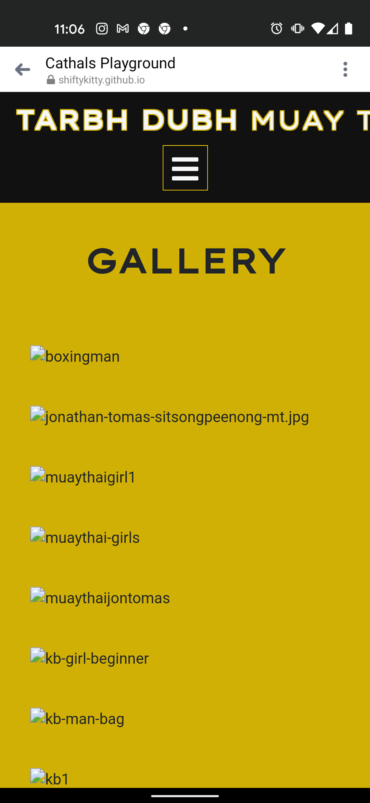
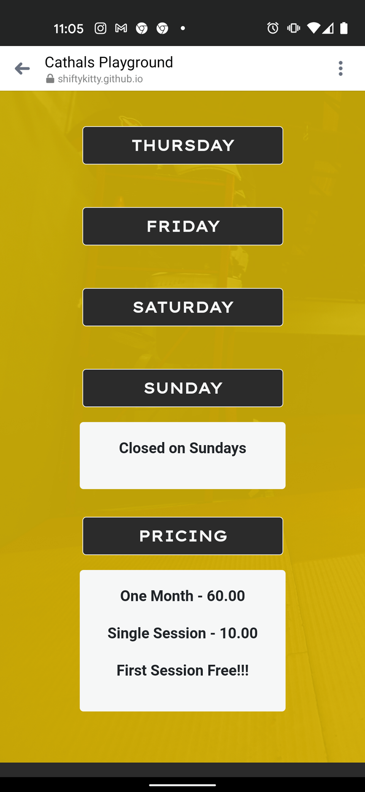
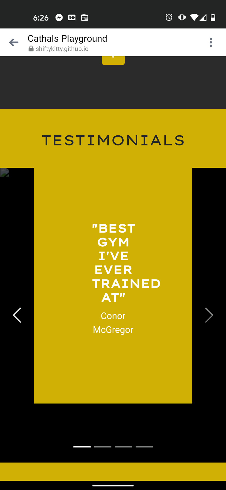
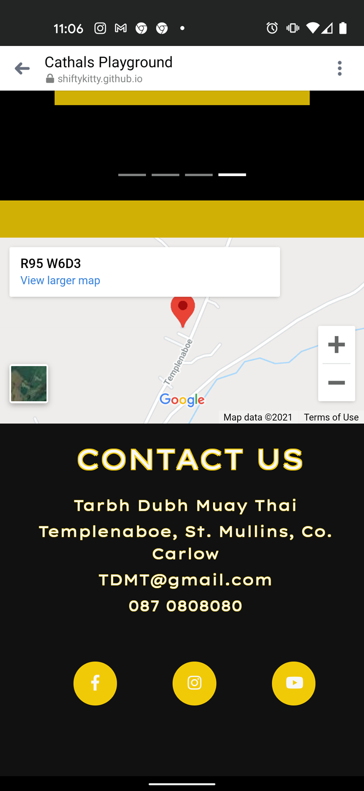
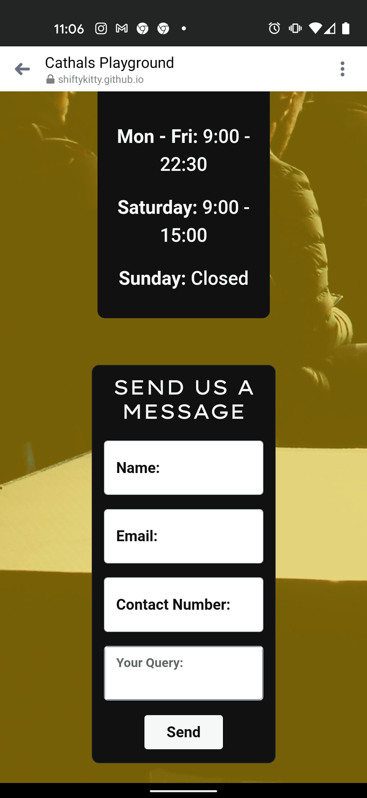

# Project Name - Tarbh Dubh Muay Thai

12/02/2021

The purpose of this project is the create an online platform for Tarbh Dubh Muay Thai to 
provide it users a way of being able to interact with the gym and find important information 
regarding class schedule, resources on offer, membership plans/prices, contact info, address etc. 

In addition, this is also for Tarbh Dubh Muay Thai to allow them to have a presence online and 
help drive more members and inquiries to join. It will do this by highlighting the excitement 
of muay thai and the health benefits it offers while traversing through an easy to navigate website. 

## UX

The UX for this project will be investigated through the following five planes:

### Strategy Plane:
Business goals? 
 The main goal of the business is to increase the amount of new members coming to 
the gym and help retain the existing members. 

Why are we special? 
Who are competitors? What are they doing? 
 
Within the Dublin area, the main competitor is SBG Ireland and Origins Muay Thai. Near my own home 
Carlow Muay Thai is the main competitor however do not have an online presence.

Tech considerations?  
Building for mobile demographic or scientific/formal demographic? Website will need to 
be well optimized for mobile as we suspect majority of users will be those on the go. 

Why would a user want this?  
Existing User would want this to check opening times, class schedules and contact information. 
New user would also want to check the aforementioned but also price and location

Who is my target audience?  
Target audience are customers that are looking to learn muay thai/self-defence, get fit and lose weight. 

When you go to a particular site, where do you go first?   
Existing customers want to see contact info, schedule times and contact info. New users want to be 
engaged immediately but also be able to see where price and location is. Muay thai is very niche so 
a FAQ section may also proof to be beneficial

Why do you go there in particular?  
To check opening times, schedule, contact, location and prices

What makes a good experience?  
Ease of access to information needs to be paramount which means a simple site structure. To attract new 
users to join, the site needs to be catchy and engaging from the jump. 

What's worth doing?
Opportunity/Problem | Important | Feasability/Viability
------------ | ------------- | -------------
Create Online Presence | 5 | 5
Location on map | 5 | 5
Gallery highlighting gym | 5 | 5
Image hover feature | 2 | 3
Price  | 5 | 5
Schedule & Opening hours | 5 | 5
FAQ | 4 | 5
Testimonials of existing users | 4 | 5
Iframe video on homepage to help engagement for new users | 3 | 3
Streetview type tour to allow potential users to navigate through gym | 1 | 1
Advertising and selling of gym merchandise | 1 | 1
		

Will it add value, and what value will it add?
Who's our target audience? Who is our demographic, or our demographics?   
Our target audience are current gym members and potential gym members who are looking to get fit, 
learn muay thai/self defense and lose weight 

What experiences are compelling to them?  
Seeing existing members having fun and working hard to achieve their fitness goals. 

How is our offering, or proposed offering, different from our competitors and substitutes?  
As it stands, no competitors are highlighting schedules or prices from the get go, which will be what 
new users are wanting to know. In addition, no competitors are offering any sort of notable engagement 
to attract new customers. Therefore, when a user comes on to site I want them to be engaged immediately, 
see all vital information and be able to see why doing muay thai is beneficial for them. 

 

### Scope Plane:
Whats on the table?  
Most important features at this stage in no particular order are as follows:  
* Contact info,
* About,
* Location,
* Schedule,
* Pricing,
* Opening hours,
* FAQ,
* Gallery,
* Testimonials/Reviews.

Iframing an engaging video to homepage of site is deemed important however due to current knowledge 
may be difficult to pull off. We will see how we progress. 

Want to offer a hover over feature on gallery images so that when a user puts cursor over image, the image will 
expand taking up full page. Not hugely important so will wait and see how we progress.

Streetview tour while it may look impressive is not something that is currently important or feasible 
however may be the next step in project evolution and user engagement. 

In addition, gym has merchandise (shorts, gloves jerseys) that it wants to advertise and sell online. 
Again, not deemed important or feasible at present but may be an additional feature at a later dates

Key milestones:  
1. Having Header Complete (for mobile and desktop) 
1. Footer complete (mobile and desktop)
1. Why do muay thai section complete and optimized 
1. Schedule Section complete and optimized 
1. FAQ section complete and optimized 
1. Testimonial section complete and optimized 
1. Gallery page with implementation of hover feature complete and optimized
1. Contact Us and form complete and optimized (including message showing there submission has been accepted)
1. Test and Review

User story/s:
- As a new member I want to know if joining a Muay Thai gym is for me.

- As new member I want to make an informed decision if this gym is the right choice.
 
- As a new user I want to know where the gym is.

- As a new user I want to know what time the classes are on.

- As a new user I want to know what is the pricing involved.

- As a new user I want to know what the contact information is for any follow up questions. 

- Secondly (but just as important) the user wants to know if joining the gym is going to be worth doing, 
therefore the site needs to be engaging immediately highlighting the fun, toughness and dedication it takes 
to train muay thai. Also highlighting what Muay thai is.  

- As an existing member I want to know what the schedule times are.

- As an existing member I want to know what the opening hours are. 

- As an existing member I want to know what the contact information is.

- As an existing member I am on the go and have a million and one different commitments. Therefore when I 
come to site it will most likely be on mobile. 

- When I come to the site, all this information needs to be easily obtainable.

 

### Structure Plane:
Information architecture:  
Based off the info in Strategy and Scope, a tree structure list seems to be the most appropriate structure the model 
this project on. 

Home > Gallery > Contact

Principles of Organization:  
- Currently stands that users to be engaged as soon as they come to site is main priority. Implementation of 5 
second rule. 
- Also want to show entire site map as soon as user comes on through nav bar and anchor drop links on homepage. 
- Why do muay thai will serve as the about us and will show above the fold. 
- Schedule/Pricing is a commonly used segment so will be placed in middle of homepage. 
- FAQs will primarily be focused on new users. 
- Testimonials will show towards bottom of page. Even though important want to use as reinforcement of users 
decision to join. 
- Footer will contain map showing location, business contact info and social media links. 
- Gallery and Contact Us are easily accessible.

 

### Skeleton Plane:
Desktop Wireframes:
  
Tablet Wireframes:
  
Mobile Wireframes:

 

### Surface plane:
Font: Will be a mix of “Lexend Mega” and “Nunito Sans” 

Color: Primary color will be black and lighter shades of this. Secondary color will be Gold. Color scheme was decided using [Canva Color Wheel](https://www.canva.com/colors/color-wheel/)

Images have all been selected from image sharing sites and have been appropriately linked in the media section in 
credits

Iframe video is video made from friend who’s page will be appropriately linked in the Media section in Credits. 

## Features:

12/02/2021

This project will be composed of three main pages. The Home/index.html, the gallery page and the contact page.

Each page will have the exact same header and footer to promote familiarity. 

Header:
- Will have logo/business name and a nav bar to navigate through the site. 
- By clicking logo, users will be brought back to homepage. 
- On Homepage an Anchor drop nav bar will be added to allow users quick and easy 
navigation through homepage.

Footer:
- Will have business contact info, a map to the business location and social media links (facebook, Instagram, youtube)

Home Page: 
Will be structured in the following manner:
- Iframe video: highlighting the excitement of muay thai through video from youtube. When condensed to mobile, video 
will appear as a youtube link.
- About us: Describing why someone should do muay thai. Offer collapsible “see more” arrows
Schedule/pricing: show a 7-day schedule and offer pricing. This can be done through <table> however may look for 
something on bootstrap to perform functionality
- FAQ: offer most asked questions by beginners. Will share similar functionality to how the about us in terms of 
collapsible “see more” arrows/info
- Testimonials: 4 reviews from current/past users to help highlight you new users should join.
 

Gallery Page:

- Will host the photos of the gym of people working hard. 
- ~~Want to try and implement a hover feature on each photo so that when a user hovers cursor over image it 
expands to take up full screen size.~~ Have decided against this hover feature. Did not have desired effect. 

Contact us:
- Will offer a form requesting name, email, contact number and query area to allow for users to communicate 
easily with gym. 
- Will also have opening hours and welcome message. 
- When user selects Submit, I want to show that their application has been processed. 
Thank you for your message. A member of staff will be in contact shortly. 

09/03/2021

### Existing Features/Future features
Features Implemented:  
- Navigation to navigate through website. Each navigation element reacts when hovered on
- Anchor drop navigation added to homepage
- Video embedded to site. 
- Video changes to image when hits mobile
- Schedule collapses when on mobile device
- Faq have collapsible read more feature
- Testimonials on carrousel
- Google map of location added to footer on every page
- Gallery consists of images sourced from unsplash.com
- Contact page consists of contact info and contact form
- When you click send on contact page you are brought through to seperate page informing you that message has been sent

### Features Left to Implement
- Links for email and tel to be clickable throughout site
- Contact info added to contact form to be necessary before send button becomes available

### Features Decided Against
- Hover over feature on gallery images to allow to take full screen size. Did not add anything when implemented 
- Merch addition. Could always add gallery but would prefer to add ecom set up at later date perhaps

## Technologies Used

12/02/2021

This project will primarily be made up of HTML and CSS with elements of Bootstrap thrown in. 

HTML: Used to make framework and content of the site

CSS: Used to style this content and the webpage as a whole

Bootstrap: In initial stages will be used to create table in the Schedule/Pricing section. 
More to follow.

09/03/2021
- HTML: 
    - Used to create general framework of site.

- [Bootstrap](https://getbootstrap.com/):
    - Project uses Bootstrap to initially add [grid structure](https://getbootstrap.com/docs/5.0/layout/grid/). 
    - Project uses bootstrap for [header navigation](https://getbootstrap.com/docs/5.0/components/navbar/)
    - Project uses bootstrap to add [hamburger toggler for mobile device.](https://getbootstrap.com/docs/5.0/components/navbar/#toggler) 
    - Project uses bootstrap to add [collapsible](https://getbootstrap.com/docs/5.0/components/collapse/#multiple-targets) read more for faqs
    - Project uses bootstrap to add [carousel](https://getbootstrap.com/docs/5.0/components/carousel/#dark-variant) for testimonials
    - Project uses bootstrap to add contact [form](https://getbootstrap.com/docs/5.0/forms/floating-labels/) for contact page. 

- CSS: 
    - Used to style all HTML and Bootstrap elements in project.

## Testing

12/02/2021

After each milestone has been complete, a series of tests will be run and results documented in this section.
All HTML and CSS will go through relevant testing sites to ensure all has been T’s have been crossed and i’s have 
been dotted.

09/03/2021

After rigourous testing through use of friends and family members, the following issues have arose:
- On footer page, address email and contact number are non reactive. This will be fixed before final submission
- On contact page users were able to click send and be brought to Thank You message page without filling in any details
- On contact page, box appearing too long due to padding added to space out on mobile.
- Images on gallery page take too long to load on some tests however could be down to poor computer system currently in use. 

10/03/2021

Work to fix outlined bugs/issues highlighted on 09/03/2021:
- On footer page, address email and contact number are non reactive. This has now been fixed. Issue was down to social-media and contact-us widths colliding. Reduced width to 50% and issue has been fixed. 
- On contact page users were able to click send and be brought to Thank You message page without filling in any details. This has now been fixed. Added form parent element and required class to necessary fields. However when this was performed I noticed that users were not brought to thankyou.html. This has now been fixed by adding action="thankyou.html" to form. 

12/03/2021  
From testing and peer review with tutor Dick Vlaanderen, the following issues have now come to my attention.
- Email text area on contact form accepts any text and not specifically email only... Has now been fixed. 
- Horizontal scroll bar appearing when reduce screen size. Will test on mobile and tablet devices to check... Has now been fixed. 
- Schedule & Pricing section looks cluttered, especially on smaller devices. Will attempt to add collapsible options similar to FAQ section where user clicks on day an schedule appears. 

15/03/2021  
Schedule & Pricing section has now been altered to add collapsible display options for each day of the week. Looks considerably better and helps create further engagement with project. 

16/03/2021  
Deployed site to mobile and tablet to test further. Mobile used was Google Pixel 4a and Iphone 6SE. Tablet used was Samsung Galaxy Tab A. The following issues arised with screenshots attached. 
- Main project heading was overflowing the edge on mobile device. Have now changed font size on screens of max-width 600px. 

- Image that shows on mobile and tablet device rather than video did not appear. Have changed relative path from ../assets/images/jon-tomas-mt.jpg to assets/images/jon-tomas-mt.jpg to fix. 

- In addition, gallery images also not appearing. Have changed relative path by removing ../ to see if this resolves. 

- Sunday and Pricing parts on mobile and tablet did not appear well in comparison with the collapsible schedule. Have increased width to 100% on screens of max-width 600px and 768px to fix. 

- Testimonials section was not responding on smaller screen sizes resulting in squished wording. Have reduced size and repositioned on mobile to resolve. 

- Footer section was not aligned on mobile and tablet with contents of footer slightly shifting off line to the right. Have changed width from px to % to allow for responsiveness to happen. 

- Contact page all content appeared squished on mobile and tablet. Have changed width to 90% on screens of max-width 600px to take up more screen real estate. 

16/03/2021 (cont)  
- Redeployed project to mobile following all changes listed above and all appear to be functioning correctly. 
- Put HTML code through [W3C Markup Validation Service](https://validator.w3.org/) which brought back errors to fix. 
- Put CSS code through [W3C CSS Validation Service](https://jigsaw.w3.org/css-validator/) which brought back errors to fix. 

17/03/2021  
- Put HTML code through [W3C Markup Validation Service](https://validator.w3.org/) which now is presenting no issues after fixing.
- Put CSS code through [W3C CSS Validation Service](https://jigsaw.w3.org/css-validator/) which now is presenting no issues after fixing.

 

## Deployment

This section should describe the process you went through to deploy the project to a hosting platform (e.g. GitHub Pages or Heroku).

In particular, you should provide all details of the differences between the deployed version and the development version, if any, including:

Different values for environment variables (Heroku Config Vars)?
Different configuration files?
Separate git branch?
In addition, if it is not obvious, you should also describe how to run your code locally.

 

## Credits

## Content
- The text for Why do Muay Thai section was copied from the website [Fight City Gym](https://fightcitygym.co.uk/2018/12/13/what-are-the-physical-and-mental-benefits-of-muay-thai-training/)

- The text for FAQ section was copied from [Thai Works Gym FAQ page](https://www.thaiworksgym.co.uk/faq) 

- The opacity css styling used in Schedule and Contact page sections was taken from [Coder Coder](https://www.youtube.com/watch?v=LQsjNmkqUOc)

- Google Map iframe was taken from [embedgooglemap.net](https://www.embedgooglemap.net/?gclid=Cj0KCQiAs5eCBhCBARIsAEhk4r7YZF_CTfsY100Th_bSmSwVZL4PQfFSnNAceY3cuJYA8riqM9wR8vYaAkVAEALw_wcB)

## Media
- The photos used in this site were obtained from [Unsplash](https://unsplash.com/s/photos/boxing). 
    - Photos were taken by [Jon Tomas](https://unsplash.com/@jotomas)
    - Photos were taken by [Logan Weaver](https://unsplash.com/@lgnwvr)
    - Photos were taken by [Attentie Attentie](https://unsplash.com/@attentieattentie)
    - Photos were taken by [Lorenzo Fattò Offidani](https://unsplash.com/@lollish)
    - Photos were taken by [Alex Harmuth](https://unsplash.com/@a_harmuth)
    - Photos were taken by [Daniil Zanevskiy](https://unsplash.com/@danil_zan)
    - Photos were taken by [Nick Wang](https://unsplash.com/@nickwang14)

- The video used in this project was obtained from [Jeff Sainlar-Art of Muay Thai](https://www.youtube.com/watch?v=qJAVT5heeCo)

## Acknowledgements
- I received inspiration for this project from many sources however mainly from my own interest in Muay Thai and lofty dreams to open my own gym some day. 
- The color scheme of black and gold is synonymous with champion status in Muay thai and combat sports so wanted to preserve this with the project. 
- The name Tarbh Dubh is an irish name which translates as Black Bull. The inspiration behind this name is derived from the following:
    - This year marks the chinese new year of the ox/Bull
    - The name Black Bulls is a fictional team name of group in anime/manga series Black Clover. 
    - My family home is in place called Templenaboe which translates as Temple of the Cow. 

